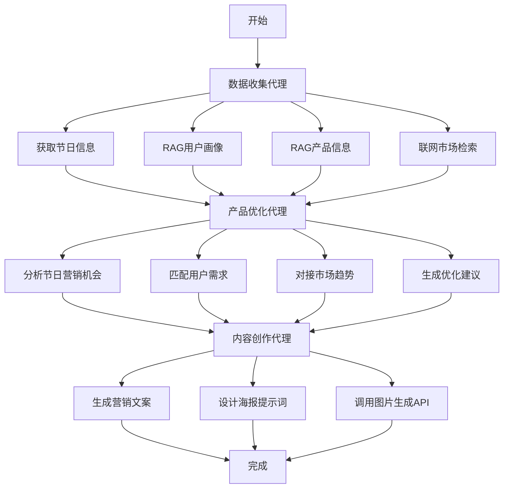

# 营销内容生成代理 (Marketing Content Generation Agent)

本项目使用 LangGraph 构建了一个自动化的营销内容生成代理。

## 功能流程

代理会按照以下顺序自动执行四个核心步骤：

1.  **触发条件研究 (Trigger Research)**: 根据输入的营销主题（如"母亲节"），通过网络搜索获取相关的背景、趋势和关键词。
2.  **产品信息检索 (Product Retrieval)**: 结合研究结果，从本地的产品知识库中检索出最匹配的产品信息。
3.  **营销文案生成 (Copy Generation)**: 利用大语言模型（GPT-4o），根据主题背景和产品信息，创作出有吸引力的营销文案。
4.  **营销海报生成 (Poster Generation)**: 调用 DALL-E 3 模型，根据生成的文案，自动设计一张配套的营销海报。

## 如何运行

我们推荐使用 `langgraph dev` 来运行和调试此代理，它提供了一个强大的可视化界面。

### 1. 安装依赖

请确保您已安装所有必需的 Python 库。

```bash
# 安装核心依赖
pip install langchain langgraph langchain-openai langchain-community faiss-cpu "unstructured[local-inference]" python-docx pillow tavily-python

# 安装 langgraph dev 开发工具
pip install "langgraph[dev]"
```

### 2. 设置 API 密钥

在运行前，请确保您的环境中设置了以下两个环境变量：

-   `OPENAI_API_KEY`: 您的 OpenAI API 密钥。
-   `TAVILY_API_KEY`: 您的 Tavily Search API 密钥（用于网络搜索功能）。

您可以在终端中临时设置：
```bash
export OPENAI_API_KEY="sk-..."
export TAVILY_API_KEY="tvly-..."
```
或者将它们添加到您的系统环境变量中。

### 3. 启动开发服务器

请在项目的根目录 (`yingxiao1/`) 下打开终端，并运行以下命令：

```bash
python -m langgraph dev src.huanmu_agent.content_generation.marketing_agent:app
```

**命令解析:**
-   `python -m langgraph dev`: 启动 LangGraph 的开发服务器。
-   `src.huanmu_agent.content_generation.marketing_agent`: 指向我们代理脚本的 Python 模块路径。
-   `:app`: 指定脚本中名为 `app` 的变量作为要运行的 LangGraph 图。

### 4. 使用调试界面

命令成功执行后，终端会显示一个本地服务器的 URL，例如 `http://127.0.0.1:58950/`。

1.  在您的浏览器中打开这个链接。
2.  在左侧的 `Input` 面板中，输入您的营销请求，格式为 JSON。例如：

    ```json
    {
        "trigger_query": "为即将到来的七夕节做准备，主推情侣对戒",
        "messages": []
    }
    ```
3.  点击 "Start" 按钮。
4.  您将能实时看到图中的每个节点被依次执行，并可以点击每个节点查看详细的输入和输出数据。

---

该代理的核心逻辑都封装在 `marketing_agent.py` 文件中，结构清晰，方便您根据需求进行修改和扩展。

# 内容生成模块 - 三代理架构

## 📋 概述

本模块采用清晰的三代理架构，分别负责数据收集、产品优化和内容创作，实现功能分离和灵活组合。

## 🏗️ 三代理架构

### 核心设计理念

1. **职责分离** - 每个代理专注单一职责
2. **流程清晰** - 数据收集 → 产品优化 → 内容创作
3. **灵活组合** - 可独立使用或组合执行
4. **易于维护** - 模块化设计，便于扩展

### 三个核心代理

```
🔍 DataCollectionAgent     🔧 ProductOptimizationAgent     🎨 ContentCreationAgent
   ├─ 获取当天节日            ├─ 节日营销适配                  ├─ 文案生成
   ├─ RAG用户画像            ├─ 用户需求匹配                  ├─ 海报设计
   ├─ RAG产品信息            ├─ 市场趋势分析                  ├─ 风格验证
   └─ 联网检索              └─ 优化建议生成                  └─ 图片生成
```

## 📁 文件结构

```
content_generation/
├── __init__.py                          # 模块导出
├── schemas.py                           # 数据模式
├── tools.py                            # 工具函数
├── workflow.py                         # 三代理工作流 ⭐
├── data_collection_agent.py            # 数据收集代理 🔍
├── product_optimization_agent.py       # 产品优化代理 🔧  
├── content_creation_agent.py           # 内容创作代理 🎨
├── data_fetcher_agent.py               # 数据获取工具
├── example_usage.py                    # 使用示例
└── README.md                           # 说明文档
```

## 🚀 使用方式

### 完整工作流（推荐）

```python
from huanmu_agent.content_generation import ContentGenerationAgent

# 创建工作流
agent = ContentGenerationAgent(config)

# 执行完整流程
result = await agent.generate_marketing_content(
    product_id="smart_watch_001",
    user_segment="young_professionals",
    style="professional"
)

# 检查结果
if result['workflow_complete']:
    print(f"文案数量: {len(result['copy_response'].copies)}")
    print(f"设计数量: {len(result['design_response'].designs)}")
    print(f"优化建议: {len(result['product_optimization'].suggestions)}")
```

### 独立使用代理

```python
from huanmu_agent.content_generation import (
    DataCollectionAgent,
    ProductOptimizationAgent, 
    ContentCreationAgent
)

# 1. 数据收集
data_agent = DataCollectionAgent(config)
collected_data = await data_agent.collect_all_data(product_id, user_segment)

# 2. 产品优化
optimization_agent = ProductOptimizationAgent(config)
optimization_result = await optimization_agent.optimize_product(collected_data)

# 3. 内容创作
content_agent = ContentCreationAgent(config)
content_result = await content_agent.create_content(collected_data, optimization_result)
```

### 部分工作流

```python
# 仅获取数据摘要
data_summary = await agent.get_data_summary(product_id, user_segment)

# 仅生成文案（跳过设计）
copy_result = await agent.generate_copy_only(product_id, user_segment)
```

## 🔧 代理详细说明

### 1. DataCollectionAgent - 数据收集代理

**职责**：收集所有必要的基础信息

**功能**：
- 📅 获取当天节日信息（可接入节日API）
- 👥 从RAG系统获取用户画像
- 📱 从RAG系统获取产品信息  
- 🌐 联网检索最新市场数据

**输出**：
```python
{
    "holiday_info": {...},      # 节日和营销时机
    "user_profile": {...},      # 用户画像和偏好
    "product_info": {...},      # 产品特性和卖点
    "market_feedback": {...},   # 市场趋势和反馈
    "collection_complete": True
}
```

### 2. ProductOptimizationAgent - 产品优化代理

**职责**：基于收集数据分析并优化产品策略

**分析维度**：
- 🎉 节日营销适配
- 👥 用户需求匹配
- 📈 市场趋势对接
- ⚡ 产品功能优化
- 📢 营销策略建议

**输出**：
```python
{
    "suggestions": [...],    # 结构化优化建议
    "summary": "...",       # 优化总结
    "error_message": ""
}
```

### 3. ContentCreationAgent - 内容创作代理

**职责**：基于前两步结果生成营销内容

**创作内容**：
- ✍️ 营销文案（3-5条选项）
- 🎨 海报设计（设计提示词 + 图片生成）
- ✅ 风格验证和质量检查

**输出**：
```python
{
    "copy_response": {...},     # 文案生成结果
    "design_response": {...},   # 设计生成结果
    "creation_complete": True
}
```

## 📊 工作流程图



## 💡 架构优势

### 1. 清晰的职责分离
- **数据收集** - 专注信息获取，支持多源数据
- **产品优化** - 专注策略分析，提供决策支持
- **内容创作** - 专注创意生成，保证输出质量

### 2. 灵活的使用方式
- **完整工作流** - 一键生成全套营销内容
- **独立代理** - 按需使用特定功能
- **部分流程** - 支持数据预览、文案预生成等

### 3. 强大的扩展性
- **数据源扩展** - 轻松接入新的数据接口
- **优化策略扩展** - 添加新的分析维度
- **内容格式扩展** - 支持更多内容类型

### 4. 优秀的维护性
- **模块独立** - 单独测试和部署
- **接口标准** - 统一的输入输出格式
- **错误隔离** - 单个代理失败不影响整体

## 📈 性能特点

| 特性 | 描述 | 优势 |
|------|------|------|
| **并行处理** | 数据收集任务并行执行 | 提升效率 |
| **缓存机制** | 基础数据可复用 | 减少重复调用 |
| **错误容错** | 单个代理失败不阻塞 | 提高稳定性 |
| **渐进式执行** | 支持分步骤执行 | 灵活控制 |

## 🎯 使用建议

### 1. 完整业务场景
```python
# 推荐：使用完整工作流
agent = ContentGenerationAgent(config)
result = await agent.generate_marketing_content(product_id, user_segment)
```

### 2. 快速预览场景
```python
# 推荐：先获取数据摘要
summary = await agent.get_data_summary(product_id, user_segment)
# 根据摘要决定是否继续
```

### 3. 内容试验场景
```python
# 推荐：仅生成文案测试
copy_result = await agent.generate_copy_only(product_id, user_segment)
```

### 4. 自定义场景
```python
# 推荐：独立使用各代理
data = await data_agent.collect_all_data(...)
optimization = await optimization_agent.optimize_product(data)
content = await content_agent.create_content(data, optimization)
```

## 📝 快速开始

1. **安装配置**
```python
config = Configuration(
    model="gemini-1.5-flash",
    temperature=0.7,
    milvus_host="localhost",
    dashscope_api_key="your-api-key"
)
```

2. **执行工作流**
```python
agent = ContentGenerationAgent(config)
result = await agent.generate_marketing_content("product_001", "young_users")
```

3. **查看结果**
```python
print(f"节日: {result['holiday_info']['holidays']}")
print(f"文案: {result['copy_response'].copies[0]['headline']}")
print(f"建议: {result['product_optimization'].suggestions[0]['description']}")
```

---

*三代理架构让内容生成更加清晰、灵活和强大，每个代理专注自己的职责，协同完成复杂的营销内容创作任务。* 